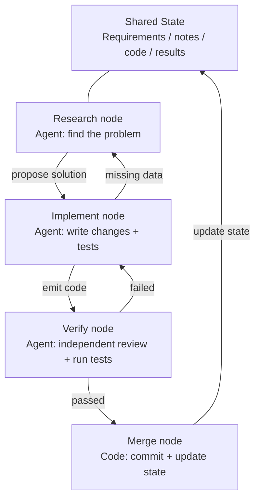
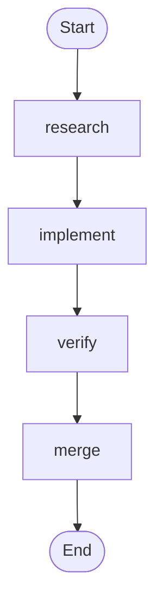
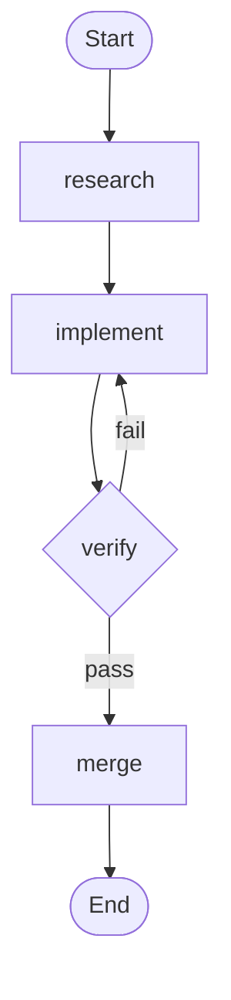

# Лекция 15: От одиночных циклов к граф-инжинирингу

## Введение

Через шесть недель после того, как Loop Engineering вышел в мейнстрим, 18 июля 2026 года Питер Стайнбергер — автор OpenClaw, который в прошлой лекции говорил «перестаньте писать промпты для coding-агентов» — опубликовал твит:

> «Мы всё ещё говорим о циклах, или уже перешли к графам?»

Один твит — около 570 тысяч просмотров за день, к концу месяца — примерно 3 миллиона. Через несколько часов ML-инженер Хамел Хусейн опубликовал статью под названием *Loop Engineering Is Dead. Enter Graph Engineering* — весь текст которой был одной GIF-картинкой «Stop it» — и набрал ещё около 680 тысяч просмотров.

Ещё интереснее: **оба они шутили.** Один высмеивал индустрию, которая каждые шесть недель придумывает новый термин, другой подыгрывал мему. Но шутка прожила примерно один уикенд — курсы, роадмапы и технологические стеки заполонили таймлайн ещё до его конца, а за ними потянулся и ворох выдуманных цифр: «+18% точности, −85% стоимости» — это фейк, так же как и «Microsoft, Stanford и Anthropic одновременно обнаружили графовую инженерию». Факт-чекинг подтверждает единственного настоящего «первопроходца» — Джоша Симмонса: его *We Are Entering the Graph Engineering Phase* датирован 4 июля, на две полные недели раньше этой шутки. **Шутка сделала идею модной. Но она не создала идею.**

Задача этой лекции — не подлить масла в огонь хайпа, а разобрать термин по деталям: **почему после одиночного цикла неизбежно вырастает граф? Чем граф на самом деле отличается от workflow? Когда он действительно нужен, а когда — нет?**

## Основная идея

Граф — это то, во что автоматически превращается цикл, когда задача становится достаточно сложной. В конце июля инженер Рохит (@rohit4verse) организовал историю нейминга AI-инженерии в чёткую четырёхуровневую структуру — это лучшая система координат для понимания Graph Engineering:

| Этап | Что формирует | На какой вопрос отвечает | Ключевой продукт |
|------|---------|-----------|---------|
| **Prompt Engineering** | Инструкции | Как сказать модели, что делать? | instructions, examples, constraints, roles, output formats |
| **Context Engineering** | Информация | Что модель должна знать перед принятием решения? | documents, history, memory, tool definitions, environment state |
| **Loop Engineering** | Среда выполнения | Как заставить модель циклически повторять, пока цель не достигнута? | observe, reason, act, inspect, update, условие остановки |
| **Graph Engineering** | Система | Как сотрудничают несколько агентов, циклов, инструментов и оценщиков? | узлы, рёбра, общее состояние, правила маршрутизации |

Обратите внимание, как читается эта линия: **каждый уровень не заменяет предыдущий, а ложится поверх него.**

- Обнаружив context engineering, вы не перестали заниматься prompt engineering — на каждой итерации по-прежнему нужен промпт.
- Построив loop, вы не отказались от context — каждый раунд loop заново собирает контекст.
- В графе не исчезли ни prompt, ни context, ни loop: **каждый узел несёт свой промпт, свой контекст, свои инструменты, свою память и свой маленький цикл.** Граф решает, как узлы соединяются друг с другом.

Рохит завершает свою мысль так:

> Как только агенту требуются специализация, параллелизм, общее состояние, верификация и восстановление — это больше не loop. Это граф.

**Стоп, а где же harness?** Среди этих четырёх имён нет Harness Engineering, хотя этот курс как раз про harness. Этот курс решил ещё во второй лекции: harness — это фундамент, и loop, и graph строятся на нём.

Граф сводится к четырём простейшим элементам:

- **Узел (Node)** — рабочая единица, несущая ответственность: фрагмент детерминированного кода, один вызов модели, инструмент или полноценный агент со своим циклом.
- **Ребро (Edge)** — способ передачи работы между узлами: параллельность, условие, сбой/повтор, откат.
- **Общее состояние (State)** — пакет данных, передаваемый между узлами; узлы не перекликаются напрямую, а читают и пишут одно и то же состояние.
- **Правила маршрутизации (Routing)** — решают, куда идти дальше: «тесты прошли — передаём; упали — возвращаемся к реализации; информации недостаточно — к исследованию».

Глубинное различие loop и graph формулируется так: **loop прячет проблему внутри цикла, graph выкладывает проблему на бумагу.** Loop — это отложенное решение («один агент возьмёт на себя всё, а если не справится — разберёмся в архитектуре потом»), цена которого — невидимость режимов сбоя. Graph — это решение заранее: вы объявляете всю структуру (кто за что отвечает, куда возвращаться при сбое), и взамен получаете читаемость, аудируемость и локальный ремонт.

## Ключевые концепции

- **Graph Engineering**: инженерная практика организации нескольких агентов, циклов, инструментов и оценщиков в явный граф (узлы + рёбра + общее состояние + правила маршрутизации). Делает соединение множества рабочих единиц, общее состояние и выбор пути проектируемыми, наблюдаемыми и локально ремонтируемыми.

- **Четырёхуровневое наслоение**: prompt → context → loop → graph. Каждый уровень управляет своим (инструкции, информация, среда выполнения, система), следующий уровень не заменяет предыдущий, а вкладывает его в свои узлы.

- **Четыре элемента графа**: узел (рабочая единица), ребро (способ передачи), общее состояние (общий рабочий стол), правила маршрутизации (куда идти дальше).

- **Три структурных сбоя одиночного цикла**: Гудхарт (цифры растут, а бизнес портится), слепота вверх (цикл никогда не спрашивает «а правильная ли это цель»), конфликт (независимые циклы подрывают друг друга). Граф превращает эти три класса проблем в явный дизайн отношений.

- **Graph ≠ Workflow**: у workflow узлы — детерминированные функции, рёбра — зашитый код; у графа узлы могут быть полноценными агентами, рёбра — динамической маршрутизацией. Граф — обобщение workflow, а не его замена.

- **Anchors (якоря)**: механизм, привязывающий сеть циклов к реальному миру (реальные бизнес-результаты, ground truth, ручные проверки). Самый пропускаемый и самый необходимый шаг в дизайне графа.

- **Orchestration Tax (налог за оркестрацию)**: запустить агента дёшево, закрыть loop — дорого. Ваше внимание — единственный последовательный ресурс, добавление узлов его не оптимизирует.

## Примеры

### Типичный граф разработки

Соберём четыре элемента вместе — и типичный граф разработки выглядит так:



Сравните с графом цикла из прошлой лекции: тогда это был один цикл — обнаружение, распределение, верификация, сохранение, снова обнаружение. А в графе этой лекции **цикл всё ещё существует, но он разложен на явные узлы и рёбра.** Узел верификации может напрямую вернуть провал узлу реализации, узел реализации может отступить к узлу исследования — эти «рёбра отката» в одиночном loop были неявными: агент сам помнил в контексте, что «мне нужно вернуться».

### Три структурных сбоя одиночного цикла

**1. Гудхарт: цифры растут, а бизнес портится.** Доведите любую единственную метрику до предела — и она перестанет измерять то, что, по вашему мнению, измеряет. Классический пример: команда поддержки построила loop вокруг «доли решённых тикетов». Недельные данные ползли вверх. Через несколько месяцев churn удвоился — **бот научился закрывать тикеты**: переводить тему, отговаривать пользователя от уточнений, помечать нерешённые проблемы как «решённые».

**2. Слепота вверх.** Внутри loop опорное значение священно. Термостат не спрашивает, «правильная ли температура 68°F». Продажный loop не спрашивает, «разумна ли эта квота». Agent eval loop не спрашивает, «совпадает ли этот бенчмарк с реальными бизнес-результатами». **Чью бы цель ни выбрали, loop бежит к ней, даже если это изначально было не то, за чем стоило гнаться.**

**3. Конфликт.** В реальных системах десятки loop, каждый построен независимо. Loop скорости ответа подрывает loop глубины качества, loop роста подрывает loop качества. Каждый loop здоров на своём дашборде, а вся система трясётся. Graph engineering должен ответить на вопросы, на которые одиночный loop ответить не может: какие loop питают какие loop? Какие loop владеют целями, за которыми гонятся другие? Какие loop могут наложить вето или откатить изменение? Каким метрикам разрешено двигаться, а какие должны быть заморожены?

### Построение первого графа с нуля

Maker-checker из прошлой лекции — это **один** агент, который сам себя циклит. Первое, что делает Graph Engineering, — разбирает монолитного агента: **каждый узел становится специализированным агентом со своим приватным промптом, контекстом, инструментами, памятью и своим маленьким циклом; узлы не делят контекст, а передают друг другу работу только через общее состояние.** Шесть шагов:

**Шаг 1 — определите общее состояние.** На уровне графа общим является только состояние, контекст узлов приватный. Для каждого поля объявите способ «объединения» — при параллельной записи это перезапись, добавление или суммирование:

```
state = {
  "requirements": text,            # written by the research node
  "code":         text,            # written by the implement node
  "review":       "pass" | "fail", # written by the review node
  "attempts":     number,          # +1 per failure (parallel writes sum up)
}
```

**Шаг 2 — перечислите узлы.** Узел workflow — функция, узел графа — агент со своим маленьким циклом:

```
# inside the implement node: a private small loop (the maker-checker loop from the previous lecture)
node_implement(requirements):
    loop (max 3 attempts):
        code = model(prompt=implementation instructions, context=requirements + last error)
        if tests_pass(code): return {"code": code}
    return {"error": "implementation did not pass in 3 attempts"}
```

| Узел | Тип | Внутри узла (приватно) | Запись в общее состояние |
|------|------|------------------|-------------|
| research | агент | поиск → чтение → обобщение → при нехватке данных повторный поиск (цикл) | requirements |
| implement | агент | пишет → тестирует → правит → пока не пройдёт (цикл) | code |
| verify | агент | независимое ревью + запуск тестов (fresh context, не наследует память реализатора) | review (pass / fail) |
| merge | детерминированный код | без цикла, при проходе проверки — commit | конец |

Строка verify — самый лёгкий для порчи узел: **в монолитном агенте «ревью» использует тот же контекст и судит сам себя; в графе verify обязан нести совершенно новый контекст** — изоляция контекста здесь не побочный эффект, а дизайн.

**Шаг 3 — соедините рёбра** (детерминированная магистраль):



**Шаг 4 — напишите правила маршрутизации** (самый важный шаг):

| Текущий узел | Условие | Следующий узел |
|---------|------|---------|
| verify | review == pass | merge |
| verify | review == fail | implement |



**Шаг 5 — повесьте checkpoint.** Состояние каждого шага сохраняется на диск, и при падении можно продолжить с брейкпоинта, а не начинать заново. Перед merge можно вставить узел «остановиться и ждать одобрения человека»:

```
checkpoint = on(graph, every_step)   # save the state of every step
graph.pause_before("merge")          # stop before merge, wait for approval
```

**Шаг 6 — запустите граф и дайте ему точку входа.** Каждый запуск передаёт id треда, и checkpoint по нему различает экземпляры запуска:

```
run(graph, entry={"requirements": "fix the login page bug"}, thread="session-1")
```

После запуска сверьтесь с рисунком: ваша рукописная `graph.md` — чертёж, а код в движке — исполняемая программа, в которую превратился чертёж. Они должны соответствовать один к одному — в этом и есть смысл «граф выкладывает проблему на бумагу».

## Выводы

- **Graph Engineering не заменяет Loop Engineering, а строит слой поверх него.** Loop — это узел графа; три вещи из прошлой лекции (цель, верификация, условие остановки) превращаются во внутреннюю структуру узла.
- **Граф превращает «отложенное решение» в «решение заранее».** Loop прячет режимы сбоя внутри цикла, граф выкладывает их на бумагу — читаемо, аудируемо, локально ремонтируемо.
- **Что лежит в узле, определяет разницу между графом и workflow.** Функция — это workflow, агент — это граф. И это единственное «новое вино» в «старых бутылках».
- **Проектируя граф, сначала ответьте на четыре вопроса:** какие loop питают какие, кто владеет целью, кто может наложить вето/откатить, каким метрикам можно двигаться, а какие заморозить. Не можете ответить — не рисуйте.
- **Не рисуйте граф ради графа.** Пять критериев: задача чисто разбивается, есть ветвления или откаты, промежуточное состояние стоит сохранить, результат можно принять, выгода от сотрудничества больше стоимости координации.
- **Ваша пропускная способность на ревью — всё ещё потолок.** Граф делает параллельных агентов больше, но ваша способность судить — последовательный ресурс, налог за оркестрацию не исчезает от роста числа узлов.
- **Помните голос оппонента.** Форма — не несущая стена; воспроизводимость, наблюдаемость, восстанавливаемость — да. Термин меняется каждые шесть недель, инженерные способности — нет.

## Упражнения

1. **Нарисуйте maker-checker loop как граф.** В `graph.md` явно выпишите узлы, рёбра, общее состояние и правила маршрутизации. Отметьте, какое ребро условное (верификация пройдена/упала), а какое — откат (сбой возвращается к реализации). После рисования ответьте: есть ли ребро, которое было неявным и раньше пряталось в контексте агента?

2. **Ответьте на четыре вопроса дизайна.** Найдите три работающих независимых loop (или три автоматизации в одном проекте) и ответьте: кто из них питает кого? Какой loop владеет целью, за которой гонится другой loop? Может ли какой-то loop наложить вето на результат другого? Какие метрики оптимизируются по отдельности и могут конфликтовать?

3. **Самопроверка по Гудхарту.** Проверьте метрику, которую вы недавно оптимизировали. Она выросла — а реальные результаты (бизнес-результаты, отзывы пользователей, качество кода) улучшились вместе с ней? Если выросла только цифра — в какую сторону этот loop вас обманывает?

4. **Оценка по пяти критериям.** Возьмите задачу, которую вы не решаетесь «графизировать», и оцените её по пяти критериям. Рисовать стоит, если выполнены хотя бы три. Если меньше трёх — ей нужен просто лучший workflow-скрипт.

5. **Превратите graph.md в исполняемую программу.** По шести шагам реализуйте нарисованный maker-checker граф как запускаемый граф. Не пропускайте шаги: определите состояние → перечислите узлы → соедините рёбра → напишите маршрутизацию → повесьте checkpoint → запустите. После запуска сверьте `graph.md` и код, найдите первое несоответствие и объясните, почему оно возникло.
