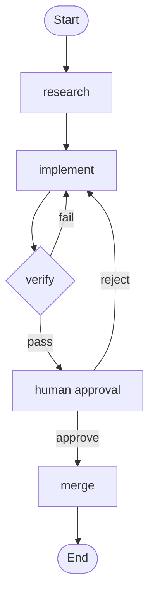

# Проект 8: Нарисуй свой workflow как граф

Это переходный проект от «Loop» к «Graph». В прошлом проекте вы построили maker-checker loop — реализация, верификация, обратная связь, снова реализация, все решения в контекстном окне одного агента. Теперь вы **явно выпишете структуру, спрятанную в цикле**: узлы, рёбра, общее состояние, правила маршрутизации — слово за словом. Вы сделаете три эксперимента: нарисуете loop как явный граф, добавите параллельный узел fan-out/fan-in и добавите условное ребро отката с узлом ручного согласования.

## Цель

Научиться превращать неявную структуру цикла в явный граф. По завершении вы на себе почувствуете главное: **граф — не новое изобретение, это то, во что превращается ваш loop, когда становится достаточно сложным.** Ключевые навыки — выписывать узлы, рёбра, общее состояние и правила маршрутизации, а также находить «бывшие неявными» пути решения.

## Шаги

### Подготовка

1. Начните с репозитория после Project 7 или возьмите любой запускаемый агентный workflow.
2. Создайте три ветки: `p08-explicit-graph`, `p08-parallel`, `p08-human-in-the-loop`.
3. Подготовьте `state.md` — файл общего состояния: требования, прогресс, результаты верификации.

### Эксперимент 1: нарисуйте loop как явный граф

1. Перечислите все узлы maker-checker loop: ответственность, вход, выход, агент или детерминированный код.
2. Нарисуйте все рёбра, особо отметив условное ребро (верификация пройдена/упала) и ребро отката.
3. Выпишите поля общего состояния — кто читает, кто пишет.
4. Запишите правила маршрутизации на языке if-then.
5. Соберите всё в `graph.md` с mermaid-диаграммой, таблицей узлов и правилами.
6. Найдите минимум одно **бывшее неявным ребро**, которое раньше пряталось в контексте агента.

### Эксперимент 2: добавьте параллельный узел fan-out / fan-in

1. Найдите в задаче точку для параллелизма (два независимых модуля, две независимые проверки).
2. Запишите правило fan-out: «задача разбита на N параллельных подзадач».
3. Запишите правило fan-in: кто объединяет результаты и по какому критерию.
4. Изолируйте каждую подзадачу в отдельном git worktree.
5. Зафиксируйте wall-clock время до и после параллелизма, расход токенов, качество.

### Эксперимент 3: добавьте ребро отката и узел ручного согласования

1. Добавьте узлу верификации путь «частично пройдено» — откат к **узлу, породившему проблему**, а не всегда к реализации.
2. Добавьте человеческий узел перед слиянием: граф останавливается и ждёт «одобрить»/«отклонить» в `state.md`, с правилом таймаута.
3. Напишите формат interrupt: что произошло, что изменилось, зачем нужен человек.
4. Пройдите минимум 2 полных цикла с ручным решением.

## Код

Правила маршрутизации простым языком:

```
if verification passed  -> merge node
if verification failed  -> implement node
if implement lacks data -> research node
```

Mermaid-диаграмма графа с откатом:



Формат запроса на ручное согласование:

```markdown
# Approval Request

## What happened
Verification passed for the document-import feature.

## What changed
- import service, indexing service, 3 new tests

## Why a human is needed
The change touches the shared data schema.

## Consequences
- Approve: merge and update state
- Reject: roll back to implement node
```

## Проверка

| Показатель | Эксп 1 (явный граф) | Эксп 2 (параллелизм) | Эксп 3 (человек+машина) |
|------|----------------|--------------|------------------|
| Видимость структуры | Сколько неявных рёбер найдено? | Поддерживает ли состояние параллельные подзадачи? | Локализует ли откат проблемный слой? |
| Локализация сбоя | Можно ли указать неверное ребро? | Какой именно подзадаче не удалось? | Какой слой — причина отклонения? |
| Накладные расходы | Сколько заняло рисование? | Экономия времени vs координация | Время ожидания vs ценность остановки |
| Надёжность | Совпадает ли граф с запуском? | Корректен ли критерий fan-in? | Срабатывают ли таймауты? |

Итог — понимание, какие задачи заслуживают графа (ветвления и откаты), а какие остаются простым workflow.
